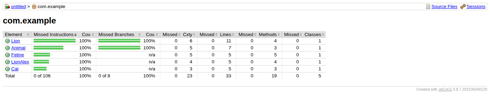

# Madagascar — unit-тесты

[](https://github.com/TatyanaKovalewa/madagascar-unit-tests/actions/workflows/tests.yml)
[](https://openjdk.org/projects/jdk/11/)
[](https://junit.org/junit4/)
[](https://site.mockito.org/)

**40 тестов, все проходят. Покрытие всех классов — 100%.** Отчёт о покрытии собирается в CI и публикуется автоматически:

**👉 [Открыть отчёт JaCoCo](https://tatyanakovalewa.github.io/madagascar-unit-tests/)**

[](https://tatyanakovalewa.github.io/madagascar-unit-tests/)

| Класс | Строки | Ветки |
|-------|--------|-------|
| `Lion` | 11/11 | 4/4 |
| `Animal` | 7/7 | 4/4 |
| `Feline` | 5/5 | — |
| `LionAlex` | 5/5 | — |
| `Cat` | 5/5 | — |

Планка зафиксирована в `pom.xml`: правило `jacoco:check` требует **100% строк и веток** по каждому классу, и сборка падает, если покрытие просядет.

---

Учебный Java-проект, демонстрирующий объектно-ориентированное программирование и модульное тестирование с использованием **JUnit** и **Mockito** на примере иерархии животных из вселенной «Мадагаскар».

---

## 📖 О проекте

Проект моделирует зоопарк с животными: кошачьи, львы, хищники и травоядные. Особое внимание уделено **Алексу** — льву из мультфильма «Мадагаскар», у которого есть друзья и своё место жительства.

Главная цель проекта — показать, как правильно писать **юнит-тесты** в Java, используя:
- моки для изоляции зависимостей;
- параметризованные тесты для проверки разных сценариев;
- тестирование исключений;
- проверку взаимодействий между классами.

Классы `Animal`, `Cat`, `Feline`, `Lion` и `Predator` — учебная заготовка Яндекс.Практикума. Моя работа здесь — тесты, класс `LionAlex` и настройка JaCoCo.

---

## 🛠️ Используемые технологии

| Технология | Назначение |
|------------|------------|
| **Java 8+** | Язык программирования |
| **JUnit 4** | Фреймворк для модульного тестирования |
| **Mockito** | Библиотека для создания моков и проверки взаимодействий |
| **Maven** | Сборка проекта |

---

## 🐾 Структура классов

```
src/
├── main/java/com/example/
│ ├── Animal.java # Базовый класс для всех животных
│ ├── Feline.java # Кошачьи (наследует Animal, реализует Predator)
│ ├── Cat.java # Кот (использует композицию с Feline)
│ ├── Lion.java # Лев (с проверкой пола и наличия гривы)
│ ├── LionAlex.java # Алекс (наследует Lion, добавляет друзей)
│ └── Predator.java # Интерфейс для хищников
│
└── test/java/
  ├── CatTest.java # Тесты для Cat с моками
  ├── FelineTest.java # Прямые тесты для Feline
  ├── FelineFoodParametrizedPositive.java # Параметризованные тесты (позитивные)
  ├── FelineFoodParametrizedNegative.java # Параметризованные тесты (негативные)
  ├── LionTest.java # Тесты для Lion с моками
  ├── LionAlexTest.java # Тесты для LionAlex
  ├── LionParametrizedPositive.java # Параметризованные тесты пола (позитивные)
  └── LionParametrizedNegative.java # Параметризованные тесты пола (негативные)
```

---

## ✅ Что тестируется

- ✅ **Звуки животных** (`Cat.getSound()` → `"Мяу"`)
- ✅ **Правильное получение еды** для хищников и травоядных
- ✅ **Наличие гривы** у львов в зависимости от пола
- ✅ **Делегирование вызовов** от `Cat` и `Lion` к мокам
- ✅ **Параметризованные тесты**:
  - позитивные сценарии (валидные виды животных, корректный пол)
  - негативные сценарии (невалидные значения, `null`, пустые строки)
- ✅ **Обработка исключений** при неверных входных данных
- ✅ **Проверка количества вызовов** моков (`verify`)

---

## 🎯 Цели проекта

- 🧪 Освоить написание юнит-тестов на Java с JUnit 4
- 🎭 Научиться использовать Mockito для изоляции зависимостей
- 📊 Понять параметризованные тесты (позитивные и негативные сценарии)
- 🔗 Изучить композицию и внедрение зависимостей через конструктор
- ✅ Потренировать проверку исключений и верификацию вызовов моков
- 🧠 Познакомиться с TDD-подходом на небольшом примере

---
  
## 🚀 Как запустить тесты

```bash
mvn clean test
```
